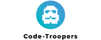

Les codes Troopers :This is Chewbacca. He's first-mate on a ship that might suit our needs. I don't like the look of this. Han Solo. I'm captain of the Millennium Falcon. Chewie here tells me you're looking for passage to the Alderaan system. Yes, indeed. If it's a fast ship. Fast ship? You've never heard of the Millennium Falcon? Should I have? It's the ship that made the Kessel run in less than twelve parsecs! I've outrun Imperial starships, not the local bulk-cruisers, mind you. I'm talking about the big Corellian ships now. She's fast enough for you, old man. What's the cargo? Only passengers. Myself, the boy, two droids, and no questions asked. What is it? Some kind of local trouble? Let's just say we'd like to avoid any Imperial entanglements.